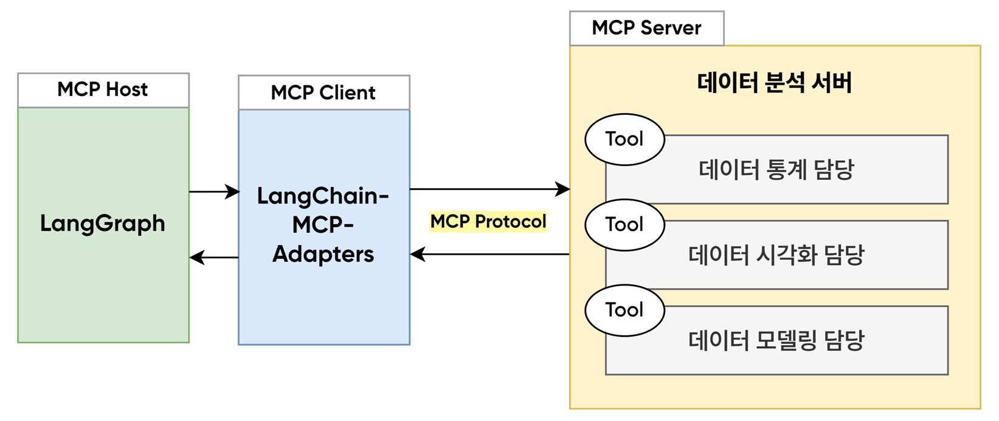

# 데이터분석 LangGraph Agent (w. Model Context Protocol)



데이터 통계, 시각화, 모델링을 진행하는 Agent를 구현하기 위해 파이썬 기반의 MCP 서버 및 클라이언트를 구축하고, [langchain-mcp-adapters](https://github.com/langchain-ai/langchain-mcp-adapters) 을 사용하여 Langgraph Agent와 연동하는 프로젝트


## Installation & Getting Started

```bash
pip install langchain-mcp-adapters
python data_server.py
python data_client.py
```

🧑‍💻 User Input Examples
> - iris_data.csv 파일의 petal length 컬럼의 통계를 내주세요.
> - iris_data.csv 파일의 sepal length 컬럼의 분포를 시각화해주세요.
> - iris_data.csv 데이터에서 sepal length,sepal width 를 피쳐로 사용해서 class_name 를 예측하는 모델을 학습하고 결과를 알려주세요.


## Reference

✅ https://github.com/modelcontextprotocol/python-sdk

✅ https://github.com/langchain-ai/langchain-mcp-adapters


---

📍 본 프로젝트는 패스트캠퍼스 **🚀 실전 AI Agent의 모든 것 : 34개 프로젝트로 MCP부터 GraphRAG Agent까지 (by.공원나연)** 강의 중 LangGraph MCP Adapters - 데이터 분석 Agent🗒️ 에 해당하는 내용입니다.

👉 https://fastcampus.co.kr/data_online_graphrag